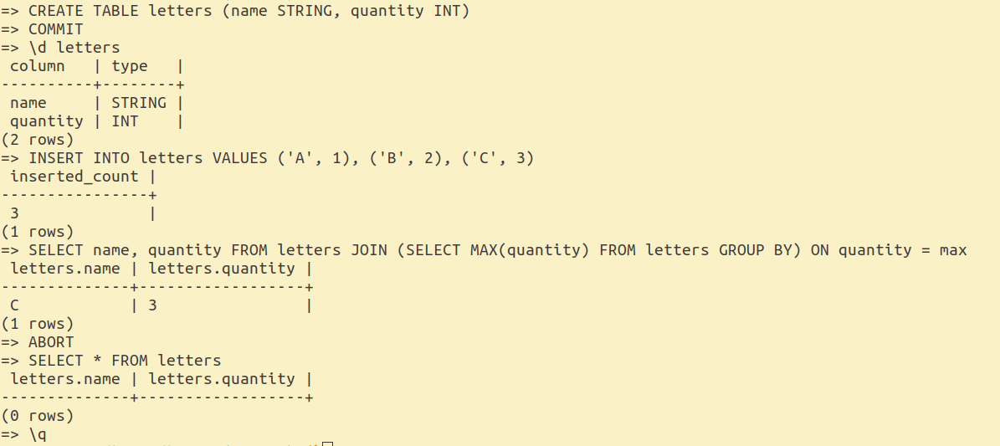

# ToyDB

ToyDB is an educational relational database management system implemented in OCaml.

## Features

- SQL support
- B+ tree index with latch crabbing protocol
- Concurrent transactions using strong strict 2-phase locking with deadlock detection
- Metadata about tables is stored as internal tables; DDL queries are internally executed as DML queries

## Architecture Overview

ToyDB follows a traditional relational database architecture:

<pre>
SQL
  ↓
Logical Plan
  ↓
Physical Plan
  ↓
Execution Engine
  ↓
Storage Layer (Heap Files / B+ Tree Indexes)
  ↓
Buffer Pool → Lock Manager
  ↓
Disk
</pre>

- SQL queries are parsed and analyzed into a logical plan.
- Logical plans are translated into physical plans.
- Physical plans are executed using an iterator-style execution engine.
- Data is stored in heap files and B+ tree indexes.
- The buffer pool manages in-memory pages and disk I/O using FORCE and NO-STEAL policies.
- The lock manager uses strong strict two-phase locking at page granularity.

## SQL Support

#### Data Types
- `INT` (8 bytes)
- `STRING` (max 32 bytes)

#### Data Definition
- `CREATE TABLE table (...)`  
- `DROP TABLE table`  

#### Data Modification
- `INSERT INTO table VALUES (...)`
- `DELETE FROM table WHERE ...`
- `COMMIT` and `ABORT`

#### Data Query
- `SELECT ... FROM ...`  
- `WHERE` (predicates of the form `field op constant`)
- `JOIN`
- `GROUP BY`
- `LIMIT` and `OFFSET`
- subqueries

## Running the Shell

```bash
opam install . --deps-only
dune exec toydb -- <db_dir>
```

## Demo


## Missing Features
- Server architecture
- Multi-version concurrency control
- Crash recovery and logging system
- Query optimization
